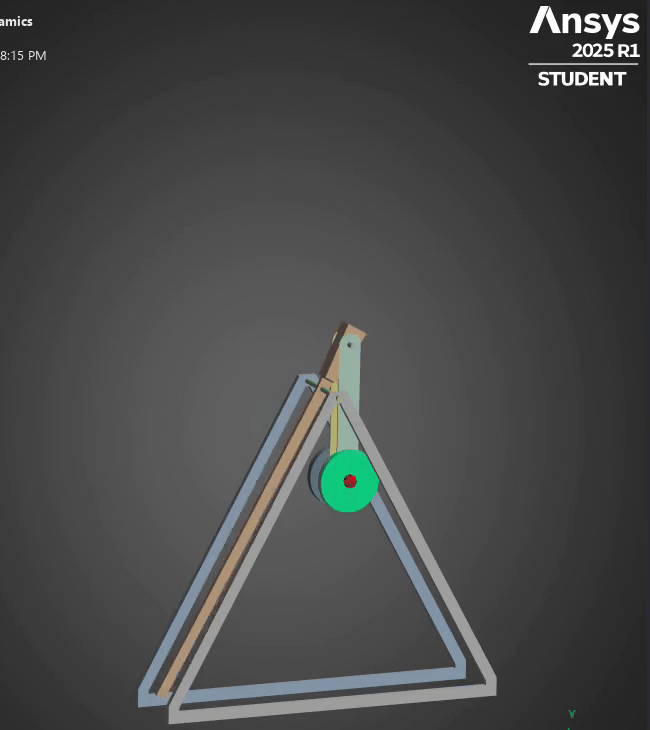

# Trebuchet

## Situation

For my senior capstone project, our sponsor wanted us to create a trebuchet which would have an electronically controlled release mechanism. Currently, trebuchets have been improved to be more efficient and launch farther, but no improvements have been made on the release mechanism. My team made a release mechanism which can release the projectile at any point so we can control where the projectile will land.

## Task  
I was tasked with designing and building a fully functional electrical trebuchet. The key tasks involved in the project were:

- **Creating the CAD model**: I developed a detailed CAD design of the trebuchet to visualize the mechanical components and overall structure.
- **Running simulations**: Using MATLAB Simulink, I simulated the trebuchet's motion and optimized the design parameters to achieve maximum performance.
- **Performing FEA**: I conducted Finite Element Analysis (FEA) using ANSYS Rigid Body Dynamics to analyze structural integrity and identify potential stress points in the trebuchet.
- **Manufacturing**: I was responsible for the manufacturing of the trebuchet, ensuring that the parts were fabricated to meet the design specifications.
- **Designing the release mechanism**: I designed and implemented a release mechanism using a solenoid, Arduino, and sensors to ensure precise control of the projectile launch.
- **Integrating electronics**: Finally, I integrated the trebuchet mechanics with the electronic control system, effectively creating an electrical trebuchet that could be operated and controlled electronically.

## Action

The first step was to design and manufacture a non-electric trebuchet. I designed with four things in mind:

- **Ease transportation**: Knowing that we would have to transport the trebuchet for testing, I implemented Design for Assembly techiniques in order to make assembly quick and easy. I also designed to minimze weight.
- **Low Cost**: With a budget of $1000, we had to minimize costs.
- **Accesible Parts**: I wanted to use readily avaible materials to minimize lead time when ordering parts.
- **Minimize Frictional Losses**: Seeing as how we were going to rely on our actual trebuchet to be exactly the same as our simulation, we had to minimize friction in order to make them as close as possible.

With all these three in mind, our first major decision was the frame material. Wood was instantly brought up but I worried about reliable FEA analysis as well as the weight. I suggested we use 80/20 T-slot Aluminum instead as it had a higher strength to weight ratio, an abundance of accesory components, easy to machine, and was readily avaiable. In order to save costs, we opted to use laser cut plywood for the brackets that held the T-slot together. 

As for the axles, FEA was ran using ANSYS in order to determine what material would be acceptable for the loads that would be encountered during a launch. Using a FOS of 2, we determined that Al-6061 would meet the requirements and we opted to go with that over a steel axle which would have been more difficult to machine. 

Friction was minimized with embedded bearings on the arm, as well as having a thin profiled arm which would minimize drag. 

Some other aspects of the modular design were adjustable arm length, variable counterweight (rated up to 60 lbs) and a 3D printed electronics bay to easily switch out components.

The next major design aspect was the release mechanism. Our team used the concept of a sliding bolt latch as the main inspiration for the mechanism. Keeping weight at a minimum at the end of the arm was essential to keep the center of mass of the arm near the pivot. For this reason we placed the solenoid at the pivot and connected it to our latch using kevlar rope which was selected based on its low elongation. The latch had a reset spring to speed up the launching capabiliies and utilized 3D printing to minimize weight. 

On the electrical side of the trebuchet, we used a Arduino BLE 33 with an onboard gyroscope to track the arm angle and control the solenoid. A dynamic model of the trebuchet was made using MATLAB Simulink in order to create a relationship between arm angle and launch velocity. Assumptions made in this model were no friction, simplified geometry, no lateral movement, and perfect energy transfer. With the arm angle and launch velocity relationship, a python based ballistic simulator was used correlate arm angle to a launch distance. Having the arm angle vs launch distance relationship, this data used on the arduino to specify the arm angle at which the release mechanism would activate based on a user desired distance.

## Result

In the end we succeeded in delivering a trebuchet with an electronic release mechanism. We did not accomplish our personal objectives of having the ability to launch to some specified distance. Due to a slow sensor and a fast moving arm, we were not able to activate the release mechanism at the correct time, which resulted in most launches traveling the exact same distance. Our max distance was around 150 ft with a launch velocity of around 60 mph. 

<!--

-->