# Actuating Fins

## Situation
My team was tasked with coming up with and creating an actuating fin design in 3 months. The rocket would reach an apogee of 2000 feet with a maximum velocity of 110m/s. The purpose of this actuating fin design was to control the roll of the rocket as it ascends.

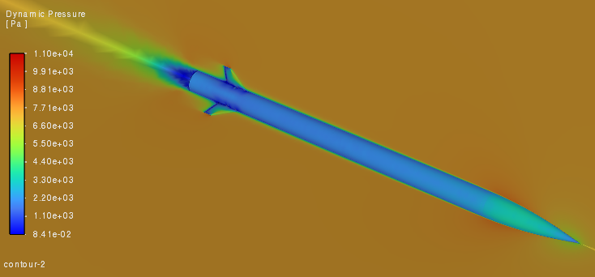

## Task  
I was responsible for designing one of the actuating fin system and performing CFD/FEA analysis. The challenge was to create a mechanism that was compact enough to fit within the rocket's 3" diameter body, robust enough to survive aerodynamic loads at high speeds, and lightweight enough to not compromise altitude requirement.

## Action
The first step was to conduct a trade study to find previous examples and brainstorm some new ones. I narrowed down on a linkage based design and some other members followed the tab design. As a result, we decided to do a design review where we would present both designs to the rest of our team in order to select one to continue with. The tab design was selected due to the following issues with the linkage design:

- More parts = more potential failure points
- More difficult for the controls team to program
- Heavier
- Consumes lots of space inside of the rocket body
- Not very scalable
- Concerns over anisotropic nature of 3D printed parts

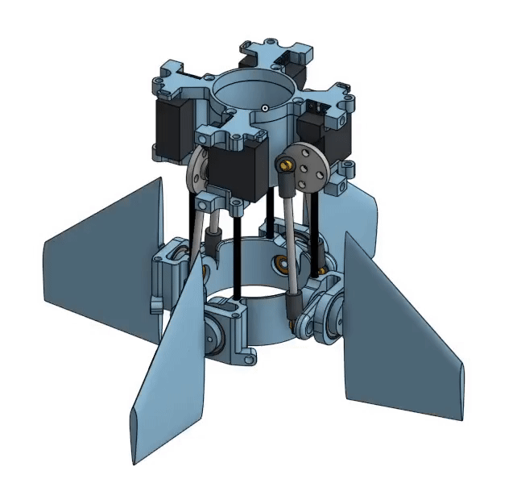

Once we had selected the tab design, I created and kept the CAD model up to date in OnShape. The tab design is very simple, where we have a 14mm thick fin (blue) and a slim servo motor (dark gray) embedded inside the fin. The servo horn(light gray) will insert into and be epoxied onto the tab(red), with a dowel rod (green) supporting rotational motion on the opposite side. This is depicted below with a cut view depiction:

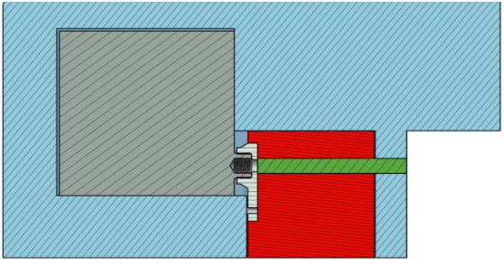

I identified two potential failure points with the design which were the servo motor being back driven due to pressure forces on the tab, or the dowel rod breaking. Through ANSYS CFD simulations I was able to find values for pressure exerted on the tab during flight. For the study, I assumed the tab would be actuated at 45deg which is more than 10x what we would normally acutate the tab to. This was in order to make sure the system and entire rocket would survive in the event of a malfunctioning servo motor that actuated to its max angle. Using this assumption, through my CFD study I found the static pressure on the tab to be 5500 Pa, a drag force of 2.6N, and a drag coefficient of 1.25.

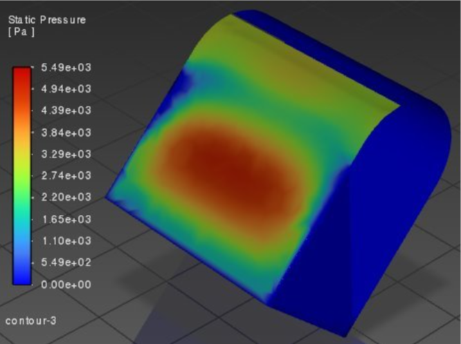

Using the values from the CFD study, I was able run an FEA study to determine that the dowel rod would not break under the pressure load as it would only ontake a force of 5N which meant the FOS was greater than 6. 

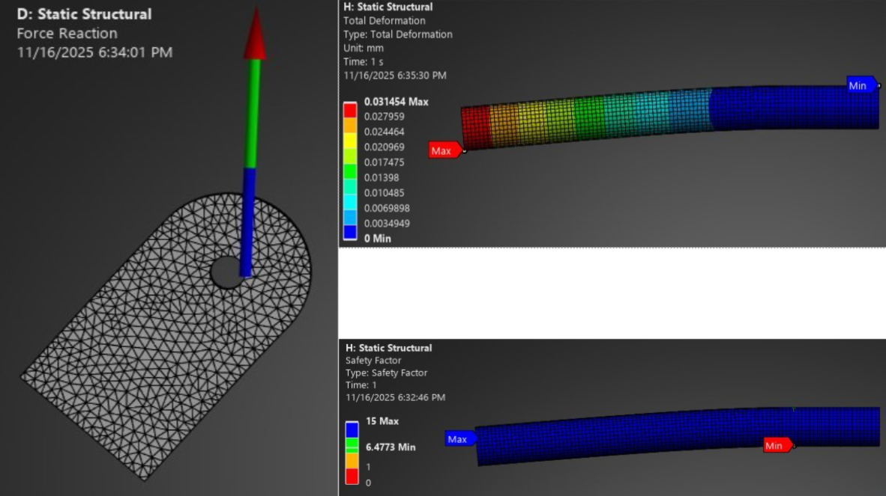

I was also able to find the torque onto the servo motor due to the drag force on the tab and found that it was 30 N-mm. The servo motors were tested to not be back driven and stil operable up to 1000 N-mm which meant that the servo motor was safe from being back driven.

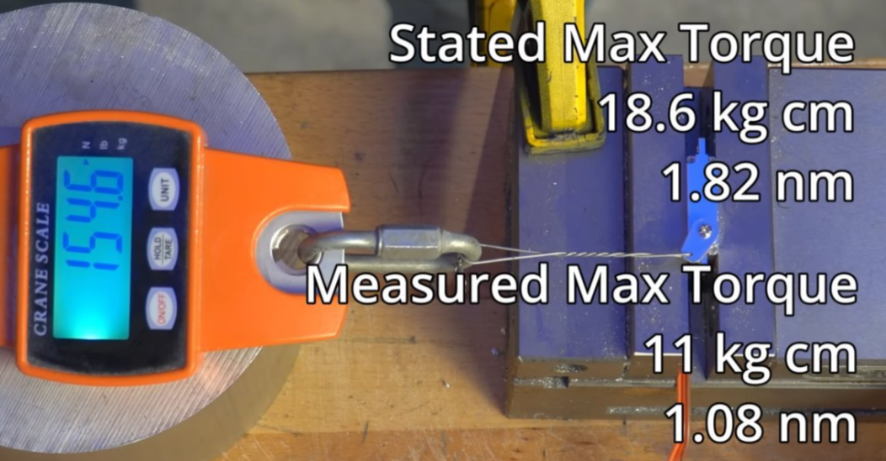

## Result
The design is fully verified through simulation, meeting all FOS and weight criteria. I finalized the testing plans to validate the physical system on the ground. The design is complete and scheduled for manufacturing, testing, and flight next semester.

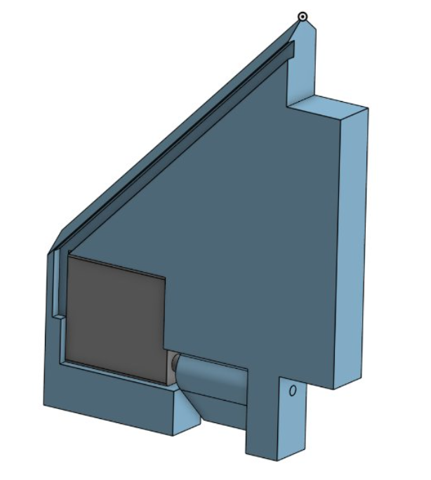

## Other Related Work
I also aided the airbrakes team with running CFD simulations for their design. I was able to obtain crucial data on the drag coefficient, and drag force over time on the air brakes that helped them validate their design. I used a transient simulation due to oscillating nature of vortex shedding on bluff plate at near mach 1 speeds.

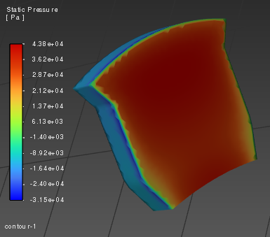

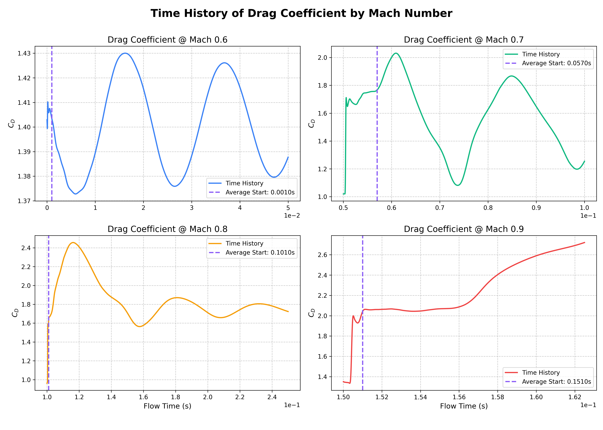

Some random pictures from CFD/FEA analysis:

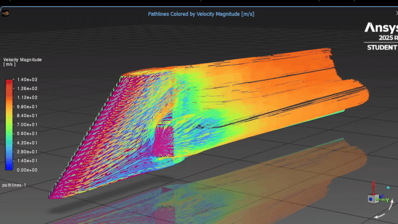

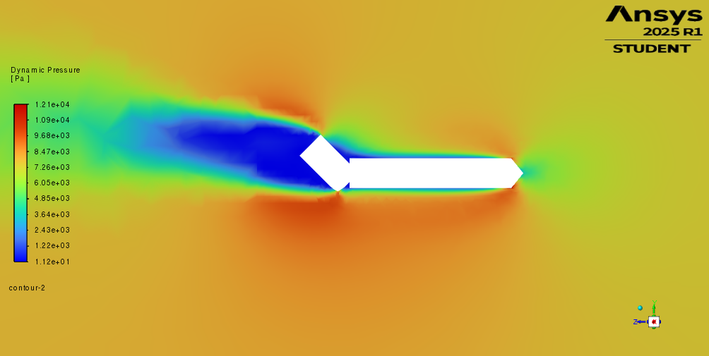

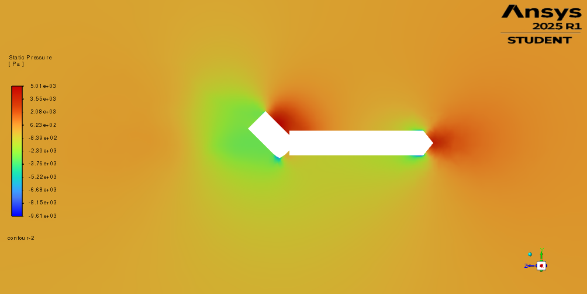