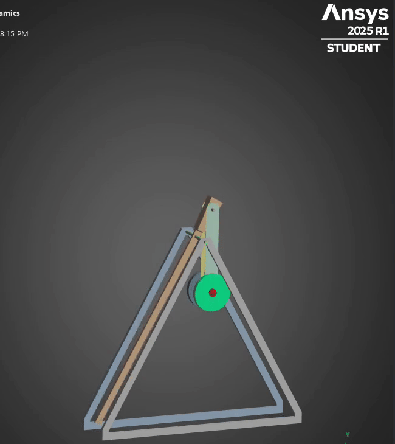
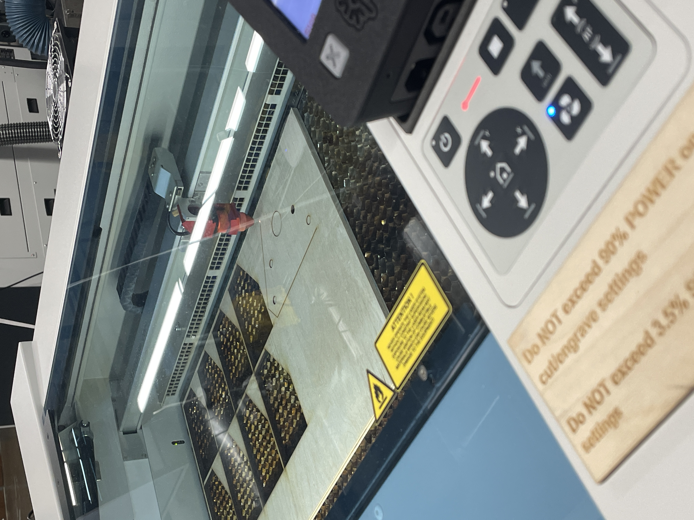

# Trebuchet

## Situation

For my senior design class, my teams sponsor wanted us to create a trebuchet which would have an electronically controlled release mechanism. Currently, trebuchets have been improved to be more efficient and launch farther, but no improvements have been made on the release mechanism. My team is making a release mechanism which can release the projectile at any point so we can control where the projectile will land.

## Task  
I was tasked with designing and building a fully functional **electrical trebuchet**. The key tasks involved in the project were:

- **Creating the CAD model**: I developed a detailed **CAD design** of the trebuchet to visualize the mechanical components and overall structure.
- **Running simulations**: Using the **Runge-Kutta (RK4) method**, I simulated the trebuchet's motion and optimized the design parameters to achieve maximum performance.
- **Performing FEA**: I conducted **Finite Element Analysis (FEA)** using **ANSYS** to analyze structural integrity and identify potential stress points in the trebuchet.
- **Manufacturing**: I was responsible for the **manufacturing** of the trebuchet, ensuring that the parts were fabricated to meet the design specifications.
- **Designing the release mechanism**: I designed and implemented a **release mechanism** using a **solenoid**, **Arduino**, and **sensors** to ensure precise control of the projectile launch.
- **Integrating electronics**: Finally, I integrated the **trebuchet mechanics** with the **electronic control system**, effectively creating an **electrical trebuchet** that could be operated and controlled electronically.

## Action

This project is currently ongoing but here are some pictures of my work and progress.

## Result

This project is currently still ongoing but at the end my team is hoping to have a trebuchet that can launch projectiles to specified targets.