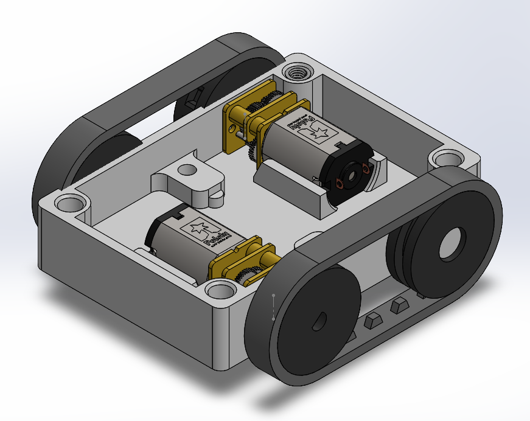
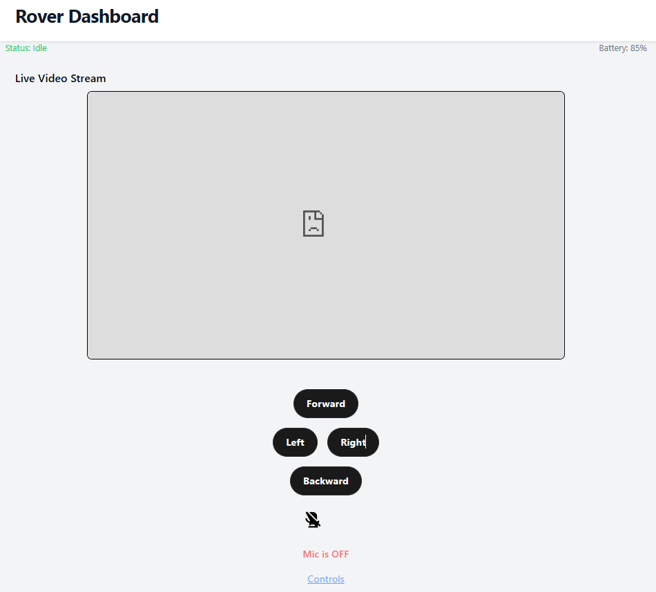

# AntBot

## Situation

I was preparing to move away for a summer internship and wanted a way to stay connected from afar. At the same time, I saw an opportunity to build a fun and meaningful engineering project—a home robot that could be controlled from anywhere in the world.

## Task  

My goal was to design and build a fully remote-controlled home robot that could:
- Move
- Stream video
- Support two-way audio communication
- Reliable
- Low-latency
- Easy to control from a simple webpage

## Action

I focused first on mobility. I designed and built a tank tread drivetrain using two micro geared motors and connected all 3D-printed parts with heat-set inserts for durability. For control and connectivity, I used a Raspberry Pi to handle networking. I created a basic web interface with login authenticawwwwtion and simple movement controls. To make it accessible worldwide, I integrated Cloudflare Tunnels to bypass NAT and port forwarding.

Currently, I’m working on integrating microphone and speaker functionality to support two-way audio through the same web interface, and finalizing the internal chassis design to make the system more robust.

## Result

This project is currently ongoing and I hope to finish it before the end of the summer.