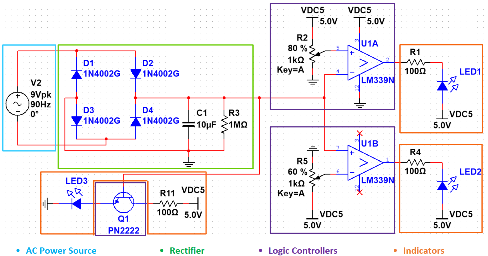
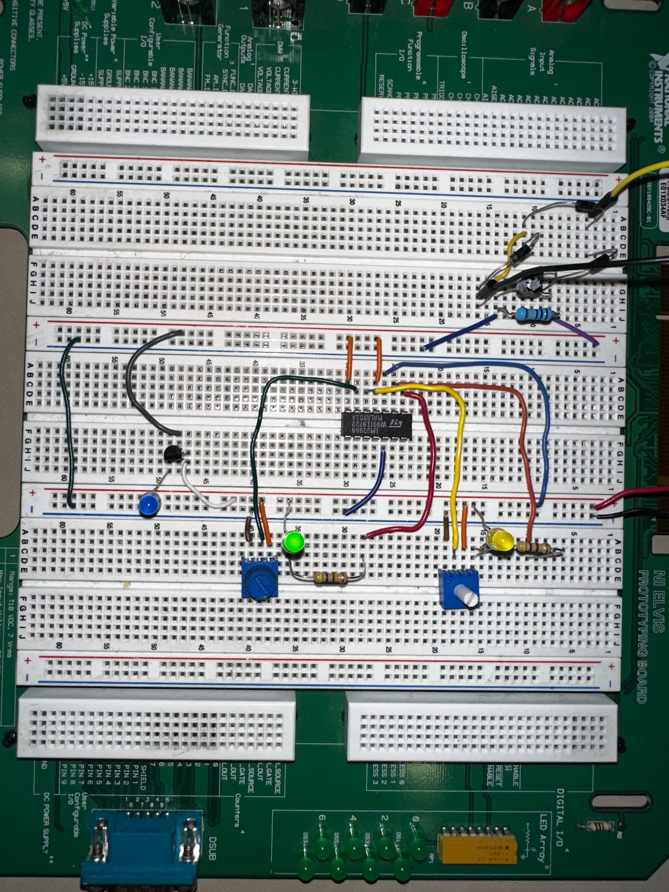

# Windmill Generator

For the final project in my Mechatronics class, I designed circuit that powered LEDs to indicate the windspeed of a windmill generator. This project allowed me to apply circuit design principles and work with components like diodes, capacitors, and comparators to achieve the desired functionality.

## Situation

This project was assigned to all students in my Mechatronics class to be completed with a lab partner. We were to use an AC brushless motor generator to power windspeed indicator LEDs. We had to demonstrate how to convert the AC voltage to DC, as well as build appropriate circuit logic for the LEDs.

## Task

The tasks for this project were outlined by the rubric:
1. Create a circuit to rectify the AC voltage source to DC
2. Implement three LEDs that indicate low, medium, and high windspeed
3. Have an LED that gradually increases in brightness with windspeed

## Action

The first step was to design the rectifier part of the circuit. My teammate and I decided to do a full wave rectifier with 4 diodes as well as a resitor and capatior to smooth the output. We first designed the circuit in Multisim to run a simulation and validate our design before trying it with real components. Once we were confident in our design we built the circuit and used an oscilloscope to view the output voltage waveform. 

For the three windspeed indicator LEDs, we used an LM339 for our two comparators. We used a DC power supply alongside potentiometers to adjust the V+/V- of the comparators to the corresponding voltages for the windspeed. The gradual LED simply used a transistor to limit the current into the LED as the windspeed increased.
 

One of the first issues we ran into when building the physical circuit was with our comparator. We had connected everything perfectly and yet the indicator LEDs wouldn't light up. Eventually after probing around with the oscilloscope, we determined that the LM339 we had was defective. We switched it out for a new one and all the indicator LEDs now worked perfectly. Our gradual LED also had an issue that was never quite solved. It did gradually increase in brightness but never reached peak brightness and didn't increase anymore once we reached half the max voltage.

## Result

The final product was a working full-wave rectifier and functional indicator LEDs that indicated windspeed. Although the gradual LED wasn't perfect, it met the project requirements, and the circuit was successfully demonstrated.
 