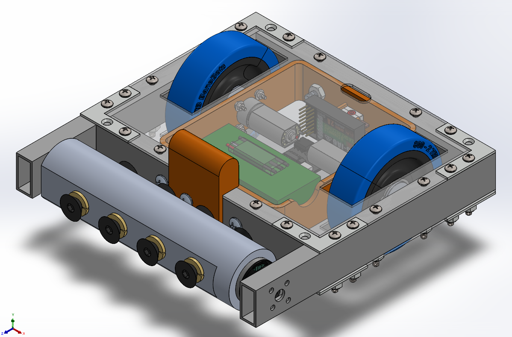
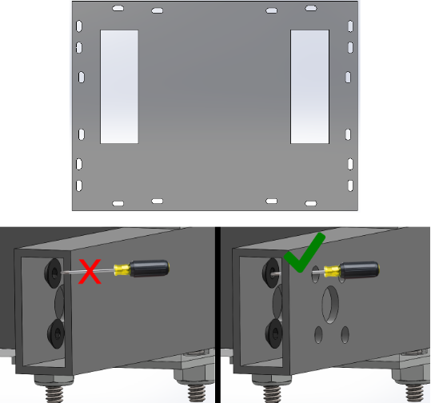
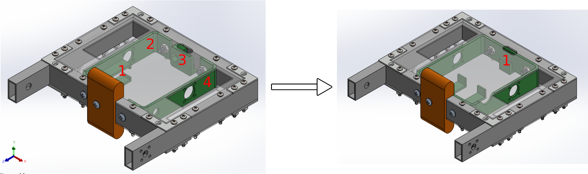
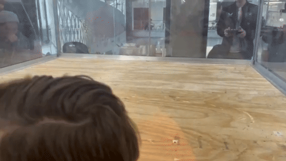
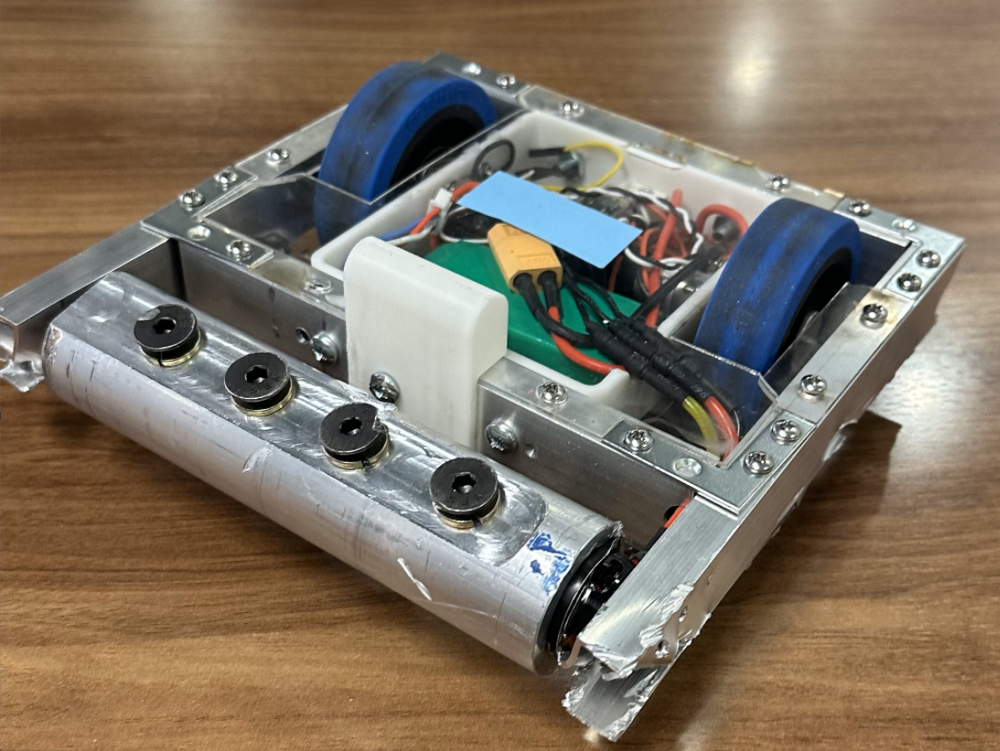

# Combat Robot - LeBot

This project was part of my **Design Methodology** class, which aims to prepare students for senior capstone projects. The task was to design and build a combat robot from scratch, following a systematic design process. Our final robot sucessfully made it to the semi-finals and lost to the eventual overall winners.

## Stage 1: Project Proposal

To kick off the project, I collaborated with my team to create a **Gantt chart** and a detailed task list to organize roles and timelines effectively. We conducted **extensive research** into the history of combat robots, analyzing key trends and successful designs. Using this research, we identified **customer needs** and translated them into **engineering requirements** and specifications through a **House of Quality** framework. Metrics and targets were derived from three successful BattleBots, and these were documented in a comprehensive **requirements list**.

## Stage 2: Conceptual Design

The next phase involved breaking the overall problem into smaller, manageable tasks. We developed **black-box and function tree models** to define the robot's functional requirements and subproblems. Several **idea generation techniques**—such as **6-3-5 brainstorming**, **mind mapping**, and **design by analogy**—were used to generate diverse concepts.

These ideas were organized into a **morphological matrix**, and we evaluated various concept variants through a **Pugh chart** using our engineering specifications as criteria. To assess feasibility, we performed **back-of-the-envelope calculations** for metrics like maximum speed, weapon energy, and impact strength.

The final design combined the best features from several initial variants after determining that no single concept met all our goals. The chosen design includes a 6061 Aluminum square tubing frame fixed together with flat L-brackets and screws. The top and bottom plates will be made out of 1/16" impact resistant acrylic.The top acrylic plate would be fixed to the frame separate from the L-brackets so as to allow for easy removal between rounds. The internal motor mounts will be made from 1/8" 5052 Aluminum sheet metal. It will feature a drum spinner weapon design made out of 6061 Aluminum with steel screws to act as impactors. The weapon will be powered by a 1450 KV brushless motor that can spin the weapon to achieve over 100J of energy. The drivetrain will be powered by a 1050 mAh battery, with brushed DC motors capable of achieve speeds of 5 mph. Finally, the main advantage of our robot was that we would be able to function fully when flipped over as our wheels stuck out from both the top and bottom.

## Stage 3: Testing and Iteration

My main contributions here included maintaining the **CAD model** and managing the **BOM** to track the project budget. I completed all the **soldering** for the electrical components. I also machined the aluminum tubes on a **manual milling machine**.

We first decided to test our drivetrain to ensure the motors, wiring, and control systems were functioning as expected. This involved assembling the drivetrain components, performing initial calibrations, and running the system under load. The successful test demonstrated that the drivetrain could achieve the required speed and torque, providing confidence in the design.

After machining the main frame pieces and laser cutting the acylic top/bottom plates, we started assembling the bot. This is where our **Design for Manufacturing and Assembly** analysis made a great impact as many issues that would've arrised had already been sorted out. This mainly includes the use of slotted holes in the acrylic for the screws to easily line up and machining access holes into the side of the aluminum tubes to allow for a screw driver to access the weapon motor screws.

Originally, we had planned to use sheet metal for our drivetrain motor mounts but we had to change plans because we did not have access to a bending brake. In an effort to simplify the design and reduce weight, I suggested we instead create one internal component which would be 3D printed and provide mounting options for all internal components. This reduced weight by 0.3 lbs and made the assembly process significantly easier and faster.

## Competition Results

LeBot was completed on time and was able to compete against the other robots in our class. Unfortunately, during the first fight, LeBot suffered a major blow which made it flip over. Although our design did allow for us to function when inverted, this hit damaged our drivetrain motors and we could not fix them from that point on. As a result, we could not get up to our desired speed so our weapon did not get enough bite and instead of launching opponents it simply grinded them down.

Even though LeBot only had one functional wheel, we were still able maneuver it enough to win fights and make it to the semi-finals. We lost to the eventual winners after sustaining massive damage to our chassis and weapon motor.

Due to the state in which LeBot was following the event, we decided it would be best to leave it in its currently assembled state. We couldn't concretely verify what had caused the drivetrain to fail but from external observations, we believe that the shaft on one of our drivetrain motors had snapped as a result of the first impact we sustained, causing the wheel to not function.

I learned a lot while working on this project. I gained a great understanding of design methodology by being able to actively practice what I learned in lecture on LeBot. I also learned new skills like how to operate a manual milling machine and a manual lathe. Below is an animated exploded view of LeBot that I made in SOLIDWORKS that I found very cool.

