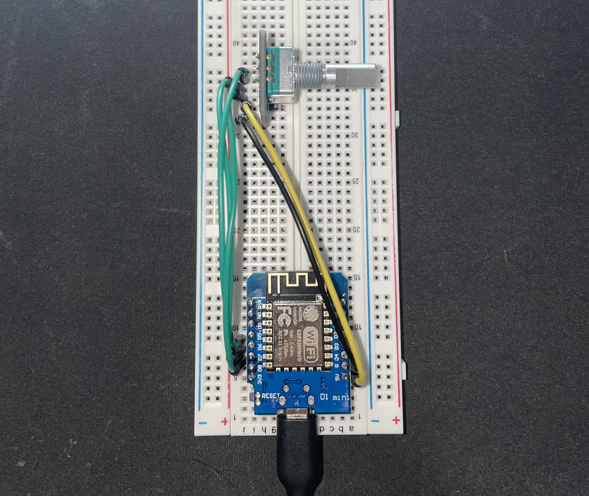
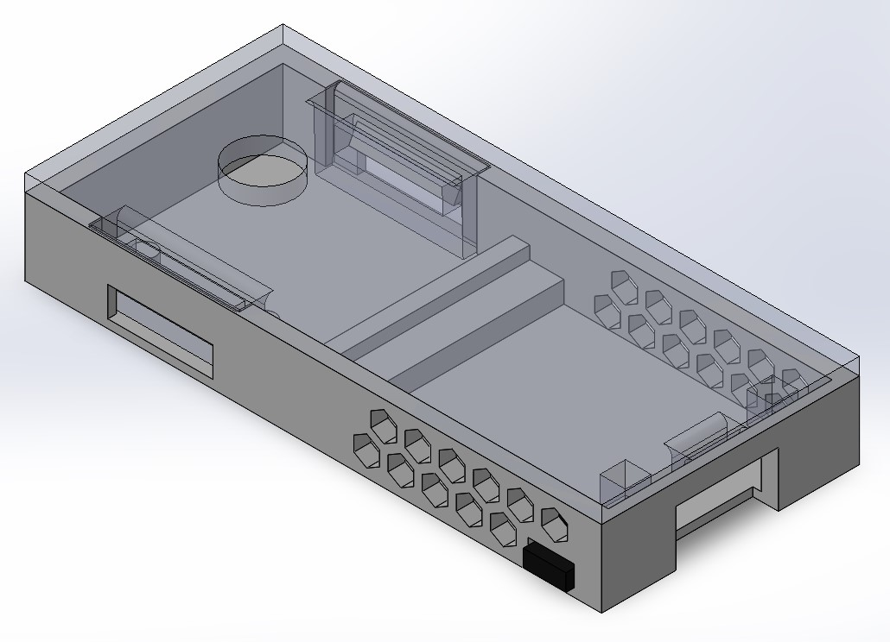

 
# Light Switch and Dimmer

I created a very simple light switch and dimmer combo device to solve many problems I had with my smart lights in my room. In this project I used knowledge I recently gained in my Mechatronics class as well as exercised some skills like CAD, soldering, coding, and rapid prototyping.

## Situation

The reason I wanted to make this device was for three reasons. 
1. Pulling out my phone or trying to get a voice assistant to understand me is too much of a hassle to simply turn on lights
2. My mom occasionally came into my room and since she isn't very tech savy, she simply used the normal switch which would reset my lights and would require me to flick the switch again to power my bulb
3. Light switch/dimmer devices were too expensive for their simple purpose

## Task

The main objective was to create a device that achieved my four main goals:
1. Reliable: Once installed it should rarely have issues like a normal light switch
2. Intuitive: Anyone must easily understand how to operate even for non-tech savy users
3. Compact: I didn't want it to stick out like a sore thumb in my room.
4. Cheap: Saving money is always good

## Action

I had to research various microcontrollers to find the smallest one that could connect to WiFi. I settled on the Wemos D1 Mini as it was cheap and fit all my criteria. I also settled on a rotary encoder as opposed to a potentionmeter because it could function as both the light switch and dimmer to reduce complexity. 
 

For the case I designed a case in SolidWorks to eventually 3D print. This case has ventilation holes on the side and utilizes snap fit design so that I can easily open it to perform maintenance when needed. I also added easy access to the reset button. 

I directly soldered wires from the rotary encoder to the microcontroller to save space and minimize cost. I also developed the code using Arduino IDE where I made use of the Phillips Hue API to control my lights. Here I ran into my only hurdle which was the fact that the API would very quickly get overwhelmed when dimming the lights. I solved this by only making API requests when a user finished rotating the dimmer knob.

## Result

The final product was exactly what I set out to create. A reliable, intuitive, compact, and cheap light switch/dimmer. 

