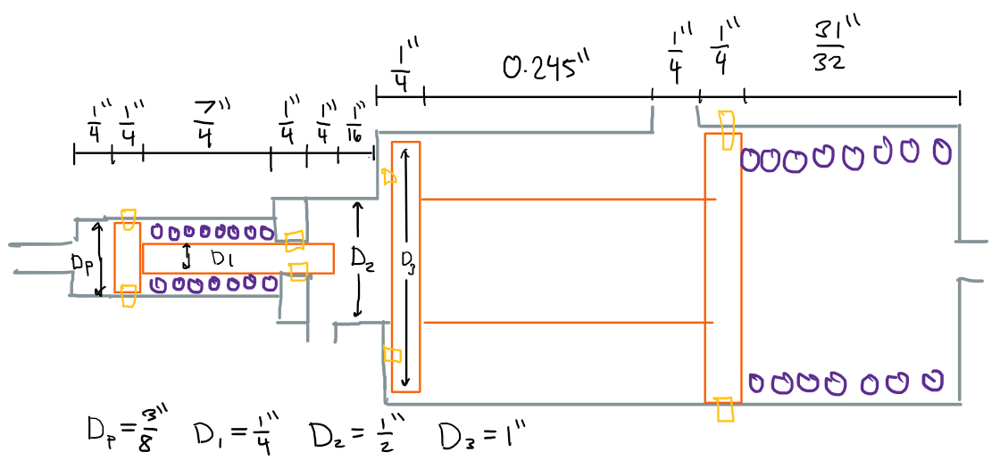
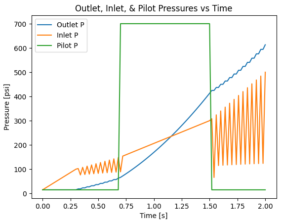

# Valve Design

## Situation

For my rocket fluid system design class, I had to design a piloted relief valve. The valve was to have a cracking pressure of 100+-10 psia, override at 700 psia, and not allow the pilot fluid to mix with the working fluid. The flow coefficient also had to fall within a range of 1e-3 and 3e-2 in^2.

## Task  
I was tasked with designing and analyzing a **pilot-operated relief valve** to meet specific performance requirements. This included the following tasks:

- Designing the valve, including creating a **cross-sectional drawing** with key dimensions.
- Selecting a **spring** to achieve the required **cracking pressure** (100 psia ±10).
- Choosing appropriate **seals** to prevent the mixing of pilot and working fluids.
- Determining suitable **materials** for strength and compatibility with **nitrogen gas** conditions.
- Calculating the **cracking pressure** and **discharge coefficient (CdA)** based on flow conditions.
- Implementing the given **pressure scenario** in Python and applying **mass flow rate equations** and **compressible flow relations**.
- Simulating the **position of the poppet(s)** at each time step and generating **pressure, mass flow rate, and poppet position plots**.

## Action

I sketched a simple cross-sectional view of the valve and used free-body diagrams to ensure the cracking pressure requirement was met. 

 

I then selected appropriate springs and O-rings from **COTS (commercially off-the-shelf)** components, sourcing springs from **McMaster-Carr** and seals from **Parker O-rings**. For the housing and poppets, I chose **stainless steel** due to its good compatibility with nitrogen gas. Once the geometry was set, I calculated the **CdA (discharge coefficient area)** of the valve to ensure it met the specified requirements. After finalizing the design, I used **Python** to apply **mass flow rate equations**, including the **choked flow equation**, along with basic **thermodynamic principles** to simulate the valve’s response to the given pressure scenario. Finally, I plotted the results to visualize how the valve performed under transient conditions.  

## Result

The final design successfully met the required specifications, including the **cracking pressure range, pilot override pressure, and flow coefficient (CdA)**. The **simulation results** provided a clear understanding of the **pressure dynamics, mass flow rates, and poppet movement** over time, validating the functionality of the valve. The Python code effectively modeled the transient system behavior, producing accurate time-series plots for **inlet, pilot, and outlet pressures**, as well as **mass flow rates and poppet displacement**. The plot below shows how the check valve chatters until the pilot is activated and slams the check valve fully open.

 

Throughout this project, I gained valuable experience in **fluid dynamics, valve design, and transient system modeling**, especially in **compressible flow analysis and thermodynamic simulations**. It was a great opportunity to apply **engineering principles** in a practical setting while strengthening my **Python programming and analytical skills**.