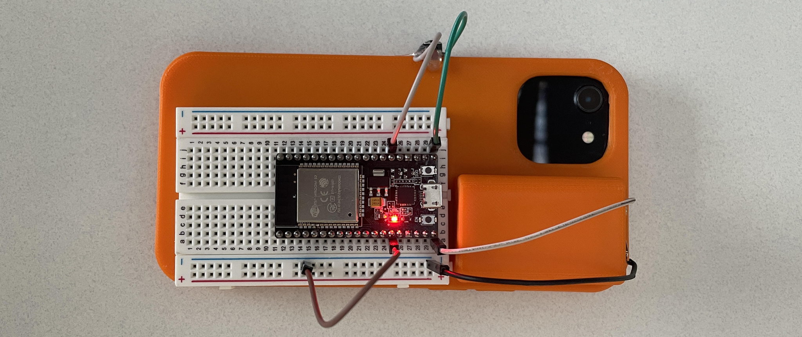
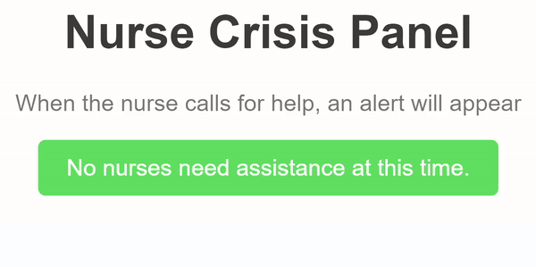
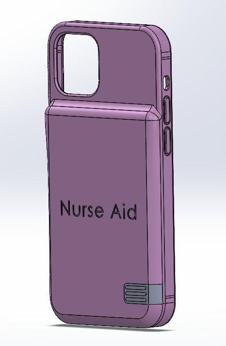
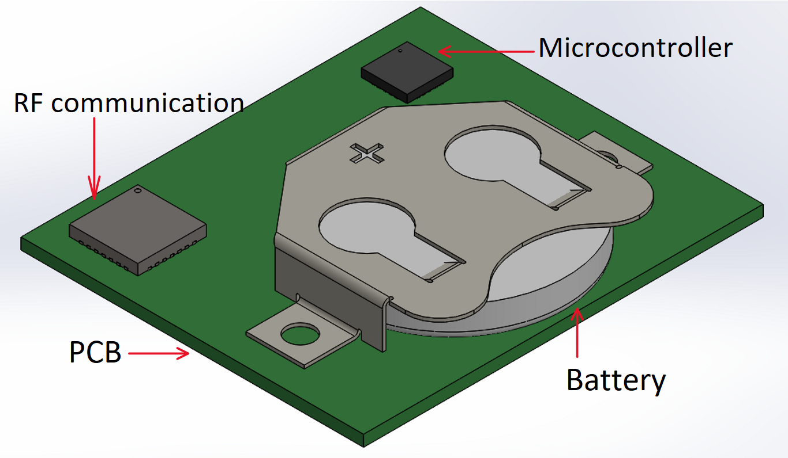

## NurseAid – Makeathon Project
*Award: Most Entrepreneurial Team*  

### Situation  
Attended a Makeathon event focused on designing a solution that enhances the well-being and efficiency of nurses in their workplace. The challenge emphasized creating a product that improves nursing work environments, addresses common issues like physical strain or workflow inefficiencies, and assists with tasks like equipment and supply transport. The focus was not on patient care but rather on supporting nurses’ day-to-day responsibilities.  

### Task  
Collaborated with my team to design and prototype a solution that addresses workplace violence, a major concern for nurses that affects their safety and ability to provide care. The solution needed to be discreet, practical, and cost-effective for hospital implementation.  

### Action  
Engaged in one-on-one discussions with nurses to understand their concerns and gathered insights to refine our approach. Developed an Arduino-powered prototype for a phone case that could be discreetly activated by nurses when they felt unsafe. Implemented a three-tier alert system: no action (0-1 second press), a yellow warning (1-3 second press), and a red alert with continuous display (3+ second press). Designed the prototype for simplicity, ensuring compatibility with nurses’ work phones, thereby avoiding the need for additional equipment.  

### Result   
Presented our working prototype and advanced to the second round of the competition. On the final day, we planned next steps for manufacturing, sourcing small, cost-effective components, and developing a coin battery-powered version for easy replacement. We also outlined our goals for a final product: low power consumption, compact design, robust RF system for room location integration, and an estimated cost of $25 per unit. While we did not place in the top three, we were honored with the Most Entrepreneurial Team award for our innovative approach. My team and I are motivated to further develop NurseAid into a real product that can positively impact the nursing community.  

