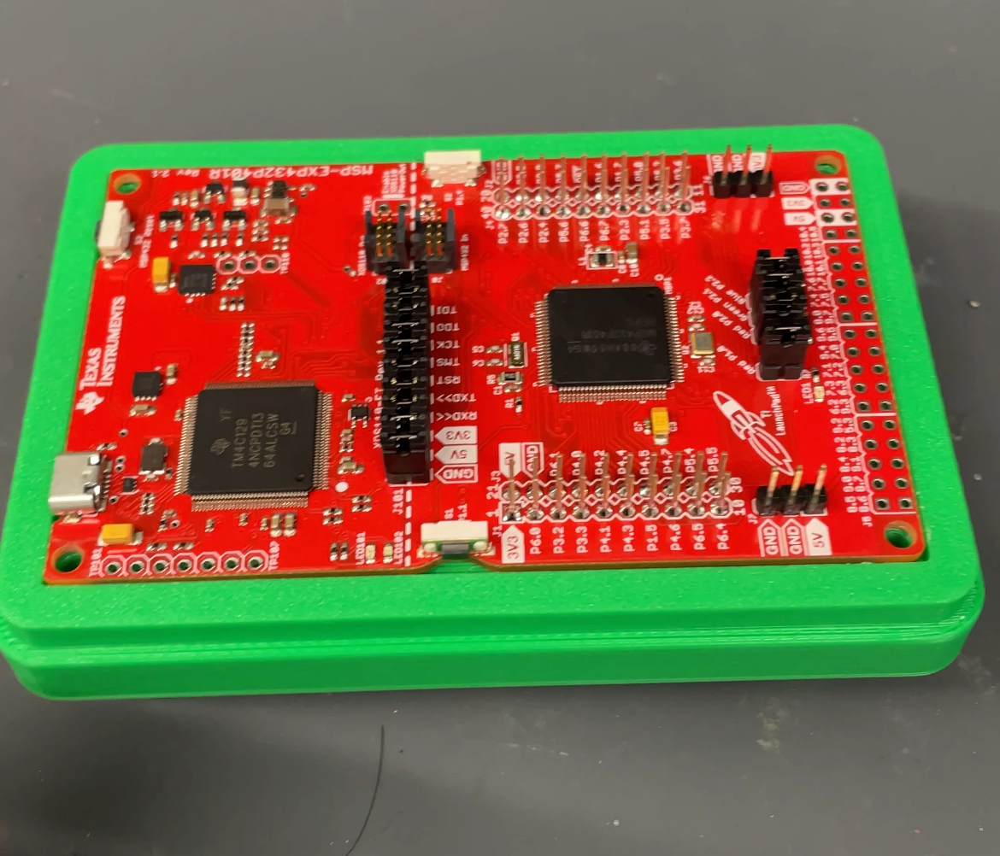
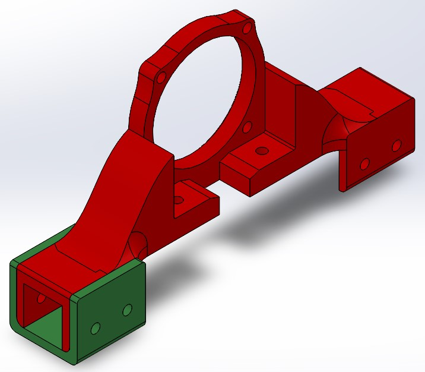

# IGVC Mechanical Team Projects

I joined my schools IGVC at the start of 2024 to learn new skills and improve others. I worked mainly on designing 3D printed parts and learned a lot about designing with the manufacturing method in mind. I learned how to use a laser cutter, work with SolidWorks Assemblies, solder, and work in a team environment.

## Microcontroller Case

My first project was to design a case for a microcontroller that would fit in the premade electronics box. There was no readily available technical drawings available online to use as reference so I had to use calipers to get the proper dimensions. My first attempt I did not measure correctly and the pin headers did not align with my design. I had to make several revisions because of the bolt holes not aligning properly and rapidly protoyped the design until it was satisfactory.
 

## Motor Mount Brackets

I was also tasked with designing U-brackets to place on the already existing motor mounts in order to securely fix the motor mounts in place and prevent failure. This was a quick project but successful one as we never had the motor mount fail again after we installed the U-brackets.
 

## Anti-Vibration Solutions

Towards the end of the semester I worked on researching how we could minimize the vibrations coming from the motors. I looked into various materials such as rubber, silicone, and Sorbothane. I decided to proceed with Sorbothane because they had technical data readily available online which detailed how to properly use it. Using various factors such as thickness, shape, durometer, and frequency of vibration, I calculated exactly the amount of Sorbothane needed and how much to compress it. I modified the current motor mount to include indents where the Sorbothane could be placed, and when bolts where torqued to spec, would compress it to the proper amount to maximize vibration dampning. Unfortunately, we were at the end of the semester so we couldn't actually install it but the groundwork was already laid down for future semesters.