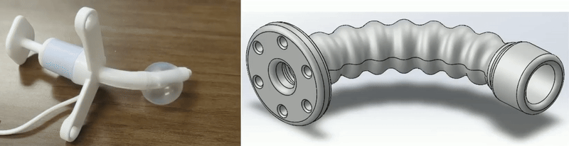
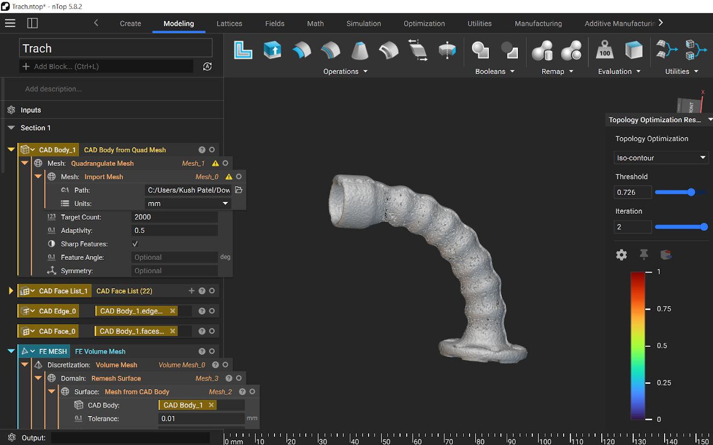

# Tracheostomy Tube Improvement for Training Dolls

## Situation

For my additive manufacturing class, our class collaborated with a team at the Dell Medical School to create a solution for tracheostomy training dolls. Training dolls are given to families for them to practice typical maneuvers associated with their childs tracheostomy tube. Some dolls allow for the trach tube to be swapped, some allow for chest rise using positive pressure via trach tube with an ambu bag; unfortunately no doll does both of these critical features. 

## Task

Our team was tasked with leveraging additive manufacturing to develop a retrofit solution for current tracheostomy training dolls. It would have to allow for both tracheostomy tube swapping and positive chest rise via the trach tube with an ambu bag. Additionally, the project required us to incorporate a novel feature into the design that would improve its usability, performance, or functionality.

## Action

To address this challenge, our team created a straightforward yet effective solution: a ribbed tube fixture that could securely house the tracheostomy tube while also connecting to the artificial lungs. This ribbed design allowed cuffed tracheostomy tubes to create an airtight seal, while simultaneously locking the tube in place to prevent accidental dislodgment during training. This innovation not only enhanced the realism of the training but also improved the safety and reliability of the setup.

I used nTopology to run a design optimization for lowering material usage while maintaining comparable stiffness. The new design did remove excess material, but since we were to use an FDM printer, it would actually use more material for new supports and worsen the surface finish. Our team decided that it was best to stick to the original design for the final product.

To integrate our solution into an existing doll, we carefully modified the doll by cutting it open from the back to insert the necessary components. This included the ribbed tube, artificial lungs, and some paper to fill the empty space. Once installed, we used glue to reseal the doll, restoring its external appearance while maintaining its new internal functionality.

## Result

Our solution was able to fully integrate both of the key functions—tracheostomy tube swapping and positive chest rise simulation—into one training doll. During demonstrations, it was also able to produce the most significant chest rise compared to every other teams solutions. 

Although the project resulted in a working prototype, it served more as a proof of concept for new technology rather than a production-ready solution. Proper integration into a training doll would require further refinement, including developing a more seamless assembly process and improving compatibility with mass-manufactured doll models. Nonetheless, the project highlighted the potential for additive manufacturing to transform medical training tools.

