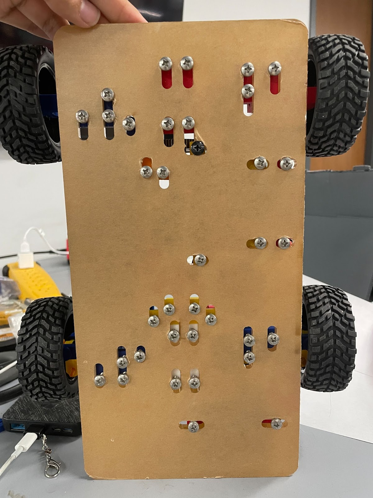
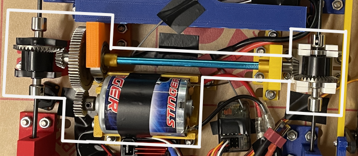

# RC Car Project

For this project, we designed and built an RC car for a class assignment. The project involved designing the chassis, integrating a powertrain, and testing the car's performance on the track.

## Situation

This project was assigned as part of our engineering coursework, where we were tasked with building a high-performance RC car. The goal was to design and fabricate a functional RC vehicle capable of high speed, acceleration, and durability, while staying within strict time and budget constraints. Our team of two worked together to design, fabricate, and test the vehicle using the resources available at the university’s lab.

## Task

Our main tasks were:
- Design a robust and lightweight chassis.
- Develop and integrate a functional drivetrain using specified motor specifications.
- Implement the control systems and electronics for steering, speed control, and stability.
- Test and optimize the car's performance in terms of speed, acceleration, and durability on the race track.

## Action

1. **Chassis Design**: We selected 12x12-inch acrylic sheets based on availability and cost and decided on a 6.5” wheelbase and 6.9” track width. The chassis was designed to support the motor, electronics, and suspension system. I personally handled the design of the chassis cutouts, which were fabricated using a laser cutter. I specifically opted to use oval shaped slots to have the ability to shift drivetrain components around so that the gears would mesh properly and maximize efficiency.
 

2. **Drivetrain Design**: Using the motor specification sheets and equations for transmission ratio and wheel size, I designed the drivetrain to achieve a target max speed of 24 mph. The drivetrain included a DC motor, pinion gear, spur gear, and differential gears, achieving a final gear ratio of 6.236:1. We mounted the 3” x 1.2” rubber/foam wheels and connected the drivetrain components to ensure efficient power transmission.
 

3. **Powertrain and Steering**: We used an all-wheel-drive (AWD) setup with a shaft-drive transmission, providing the necessary torque to all four wheels. For steering, we implemented a single-linkage steering mechanism powered by a servo motor, achieving a steering angle of 12 degrees. I would have liked to implement a Ackerman steering system but due to time opted for the simpler approach of a linkage.

4. **Electronics and Control**: We integrated various electronic components, including the Spektrum SR 315 receiver, Miuzei MZ996 servo motor, and Traxxas 1275 motor. These components were tested to ensure effective communication between the transmitter and car, with a maximum range of 500 feet.

5. **Testing and Adjustments**: We tested the vehicle’s performance metrics, including speed, acceleration, turning radius, and durability. The vehicle achieved a max speed of 12 mph, half of our predicted value due to unaccounted friction losses. After some minor crashes, we adjusted the design for better durability and improved the ground clearance to avoid interference from small obstacles.

## Result

The final RC car performed well, achieving a max speed of 12 mph, acceleration of 22 ft/s², and a ground clearance of 0.28 inches. The chassis successfully supported the powertrain, and the vehicle remained operational after impacts during testing. The project enhanced my understanding of drivetrain design, powertrain integration, and vehicle testing, and taught valuable lessons about managing unexpected challenges during the design process. Future improvements would include better impact protection and enhanced ground clearance.

