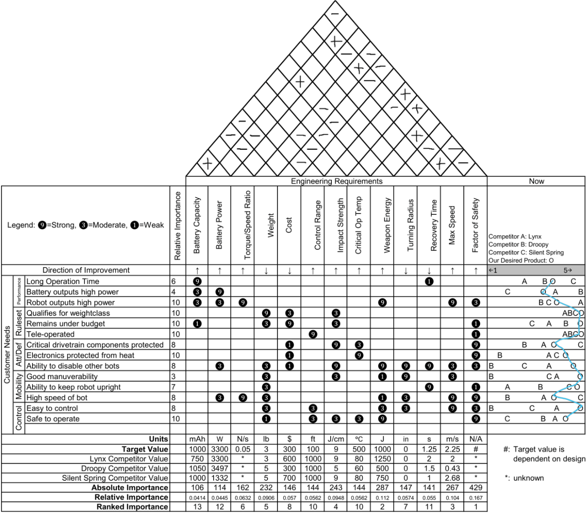
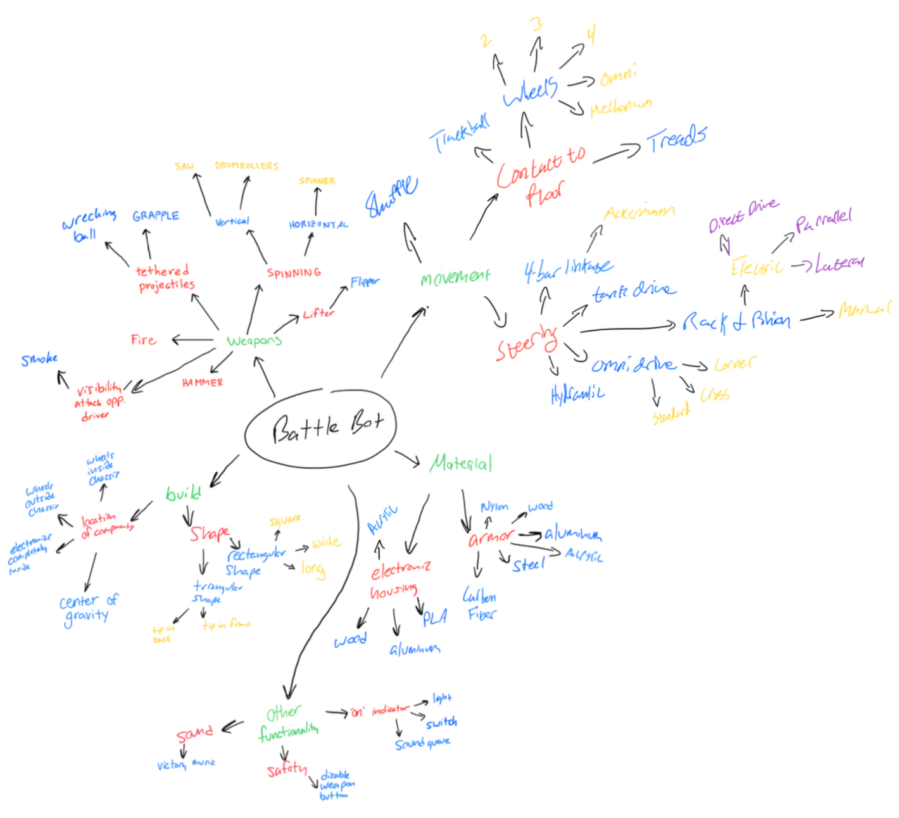

# Combat Robot - LeBot

This project was part of my **Design Methodology** class, which aims to prepare students for senior capstone projects. The task was to design and build a combat robot from scratch, following a systematic design process. The project is currently in the **manufacturing and testing** stage.

## Stage 1: Project Proposal

To kick off the project, I collaborated with my team to create a **Gantt chart** and a detailed task list to organize roles and timelines effectively. We conducted **extensive research** into the history of combat robots, analyzing key trends and successful designs. Using this research, we identified **customer needs** and translated them into **engineering requirements** and specifications through a **House of Quality** framework. Metrics and targets were derived from three successful BattleBots, and these were documented in a comprehensive **requirements list**.

## Stage 2: Conceptual Design

The next phase involved breaking the overall problem into smaller, manageable tasks. We developed **black-box and function tree models** to define the robot's functional requirements and subproblems. Several **idea generation techniques**—such as **6-3-5 brainstorming**, **mind mapping**, and **design by analogy**—were used to generate diverse concepts.

These ideas were organized into a **morphological matrix**, and we evaluated various concept variants through a **Pugh chart** using our engineering specifications as criteria. To assess feasibility, we performed **back-of-the-envelope calculations** for metrics like maximum speed, weapon energy, and impact strength.

The final design combined the best features from several initial variants after determining that no single concept met all our goals. The chosen design includes a 6061 Aluminum square tubing frame fixed together with flat L-brackets and screws. The internal motor mounts will be made from 1/8" 5052 Aluminum sheet metal. The top and bottom plates will be made out of 1/16" impact resistant acrylic. It will feature a drum spinner weapon design made out of 6061 Aluminum with steel screws to act as impactors. The weapon will be powered by a 1450 KV brushless motor that can spin the weapon to achieve over 100J of energy. The drivetrain will be powered by a 1050 mAh battery, with brushed DC motors capable of achieve speeds of 5 mph.

## Stage 3: Testing and Final Report

Currently, the project is in this phase. My contributions include maintaining the **CAD model** and managing the **BOM** to track the project budget. I completed all the **soldering** for the electrical components and contributed to testing the **drivetrain subsystem**. 

We first decided to test our drivetrain to ensure the motors, wiring, and control systems were functioning as expected. This involved assembling the drivetrain components, performing initial calibrations, and running the system under load. The successful test demonstrated that the drivetrain could achieve the required speed and torque, providing confidence in the design.

I will also oversee the **machining** of most robot components using a manual mill and a **CO2 laser cutter**, with assistance from teammates. The upcoming steps involve:

- Conducting a **Failure Modes and Effects Analysis (FMEA)** to identify potential issues.
- Performing a **Design of Experiments (DoE)** to validate the design.
- Completing a **Design for Manufacturing and Assembly (DFMA)** analysis to optimize production.

## Result

The project is ongoing, and further updates will reflect the outcomes of the testing and competition phases.
