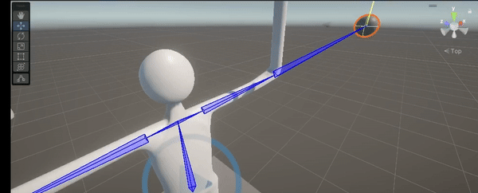

# Research on Using Consumer VR Headsets for Controlling Humanoid Robots

## Situation
As part of an Undergraduate Research Program for first generation students led by Dr. Adrian Rodriguez, I conducted research into a topic that I selected. After attending lectures on how to conduct research, I decided to look into the use of consumer VR products for controlling humanoid robots. Previous research and demonstrations have primarily focused on using VR headsets to control robotic arms. However, I found that the potential to control more complex systems, such as the upper torso of humanoid robots, had not been extensively explored.

## Task
The objective of this research was to investigate the feasibility of using the Quest 2 VR headset to control the upper torso of a humanoid robot simulation. The task involved implementing a control system that integrates VR input with robot movement. Specifically, the goal was to create a functional control system using the VR headset, ROS (Robot Operating System), and Unity XR.

## Action
1. **Research and Planning**: I began by reviewing existing research and applications involving VR headsets and robotic control to understand the state of the art and identify gaps in the current approaches.

2. **Implementation**:
   - **Inverse Kinematic Solver**: Developed an inverse kinematic solver using the FABRIK algorithm. This solver was designed to compute joint angles required to position the robot’s upper torso based on VR headset input.
   - **Integration with Quest 2 and Unity XR**: Set up Unity XR to create application where controllers and headset were properly tracked.
   - **Mesh and Bones Setup**: Attempted to set up meshes and bones for the robot simulation to ensure proper movement and visual representation.

3. **Testing and Troubleshooting**:
   - **Mesh Issues**: Encountered problems with the mesh not working correctly. Despite various attempts to adjust and configure different meshes, the issue persisted, resulting inadequate visuals that would make it impossible to accurately control a humanoid simulation.
   

## Result
Due to the challenges with the mesh not functioning as intended, and given the time constraints before the research fair, I was unable to complete the project to the desired level of presentation quality. The FABRIK solver successfully controlled the bones of the humanoid robot in simulation, but the integration with the mesh was incomplete. As a result, the project was paused, but it remains a potential candidate for future exploration and development.

## Reflection
This project provided valuable insights into the integration of VR technology with robotic control systems and highlighted the technical challenges associated with mesh and bone animations in simulations. While the project could not be completed in time for the research fair, the experience gained and the initial results achieved lay a solid foundation for potential future work in this area.
