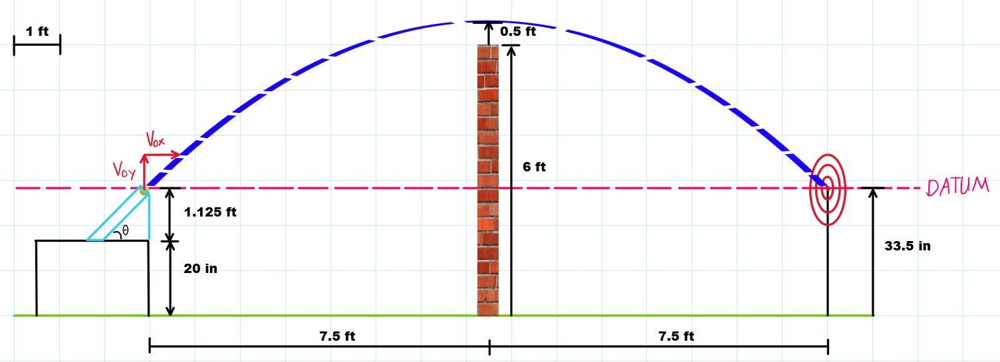
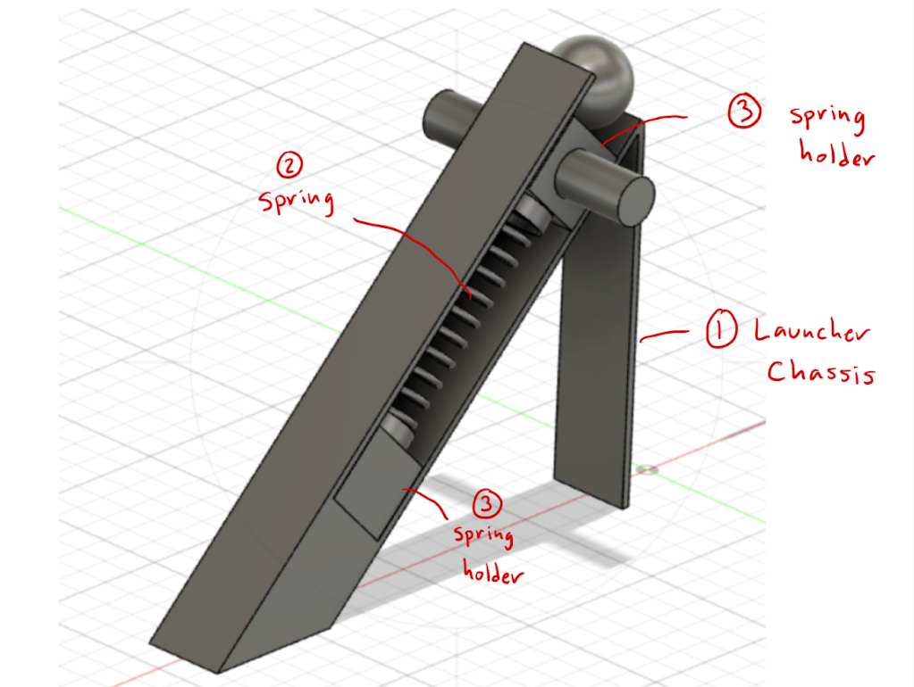

# Theoretical Tennis Ball Launcher

## Situation
In the fall of 2023, I worked on a project for my ME 314D Dynamics course that focused on applying theoretical principles of projectile motion and work-energy concepts. The task was to design a theoretical launcher capable of propelling a tennis ball to hit a target 15 feet away while clearing a 6-foot vertical wall positioned halfway between the launcher and the target. The launcher was placed on a table 20 inches above the ground, and the target was elevated 33.5 inches from the floor. With no air resistance and only gravity acting on the ball, we were tasked with determining the optimal launch conditions using projectile motion equations.

## Task
Our task was to create a theoretical design for the launcher and calculate the necessary initial velocities and trajectories to ensure the tennis ball cleared the wall and hit the target. We had to rely on kinematic equations to determine both the horizontal and vertical components of the ball's motion, and work-energy principles to calculate the force and compression required from the launcher’s spring mechanism.

## Action
We started by calculating the ball's motion using kinematic equations. By analyzing the vertical motion, we determined the initial velocity needed to clear the 6-foot wall by 0.5 feet. Using a quadratic equation, we calculated the total time the ball would be in the air, which allowed us to derive the horizontal velocity. Combining these two components, we obtained the total initial velocity and launch angle required.

Next, we shifted our focus to the launcher design. We modeled the launcher using Fusion 360 and incorporated a compression spring to provide the necessary force. To ensure accuracy, we applied work-energy principles to determine how much the spring needed to be compressed. Because we did not plan on actually building the physical model, the CAD design was very crude and basic to only support the Dynamics calculations.

## Result
The project concluded with a full theoretical design of the launcher. We successfully calculated the necessary launch velocity, angle, and spring compression using projectile motion and work-energy principles. Our theoretical design met all project objectives, ensuring the tennis ball would clear the wall and hit the target. Though the launcher was never physically built, our calculations and simulations demonstrated a solid grasp of the topic, proving our ability to apply complex physics principles in a practical, real-world scenario. This project reinforced the importance of precision in engineering and the utility of theoretical knowledge in solving real-world problems.
