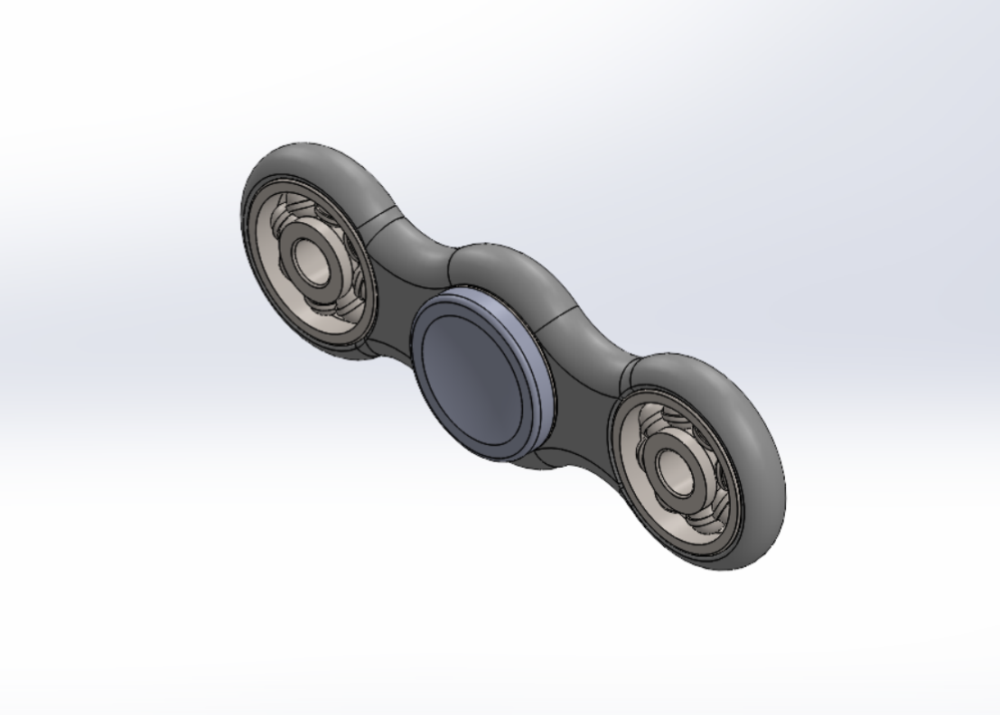
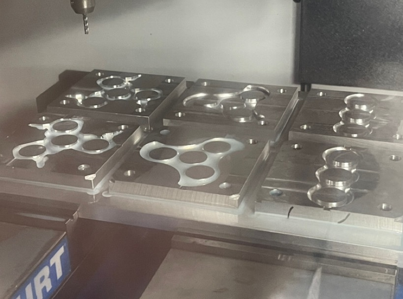
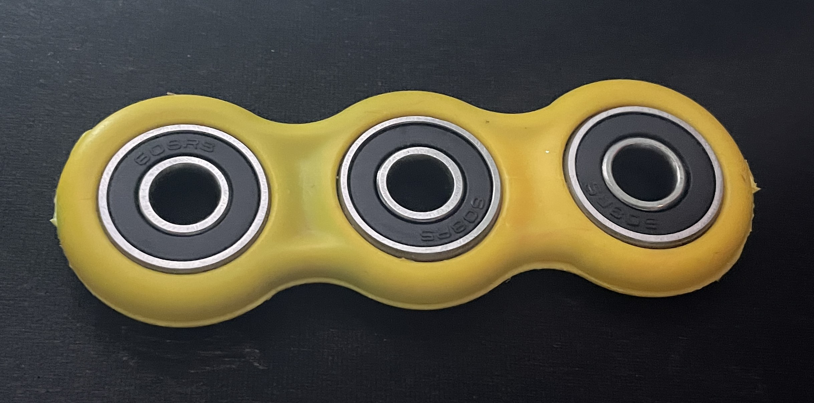

# Injection Molded Fidget Spinner

## Situation

For my introductory mechanical design class, I was tasked with designing and manufacturing a mold for a fidget spinner. The goal was to create a functional design that could be injection molded. We would use CAD software for the design and CAM software for the machining toolpath.

## Task

My responsibilities included sketching the fidget spinner concept, creating a 3D model, developing an assembly, designing the injection mold, and generating the CAM toolpath for manufacturing. I also performed FEA analysis and conducted comparisons between my design and other group members' designs, focusing on machining time, durability, and functionality.

## Action

I began by sketching the design of the fidget spinner on paper, converting it into a 2D sketch using SolidWorks, and then generating a 3D model. I created an assembly in SolidWorks to simulate the fidget spinner with its bearing and caps. After that, I designed the mold for the main body using SolidWorks' mold tools.

I used Fusion 360 to create the CAM toolpath for machining the mold and conducted FEA drop tests from waist height in SolidWorks to ensure the spinner's durability. I also designed and 3D printed the bearing caps. Additionally, I created a bill of materials (BOM) and an assembly plan.

Finally, the mold was machined by the class TA along with all the other groups fidget spinners. Once they were completed, everyone had the opportunity to manually operate the injection molding machine to create the main body. I also manually removed the body from the mold and assembled the final fidget spinner with the bearings and bearing caps.

## Result

My fidget spinner design was selected over others in my group due to its superior balance of machining time, durability, and functionality. The mold I created performed well enough but not perfectly during the injection molding process. Since we did not spend much time optimizing for plastic flow, there are some very obvious areas where there wasn't proper flow. The bearing caps I designed also fit perfectly, ensuring smooth operation of the spinner.

This project allowed me to develop a deep understanding of the CAD-to-CAM workflow, gain experience with FEA for product testing, and learn the practical aspects of injection molding and rapid prototyping.

